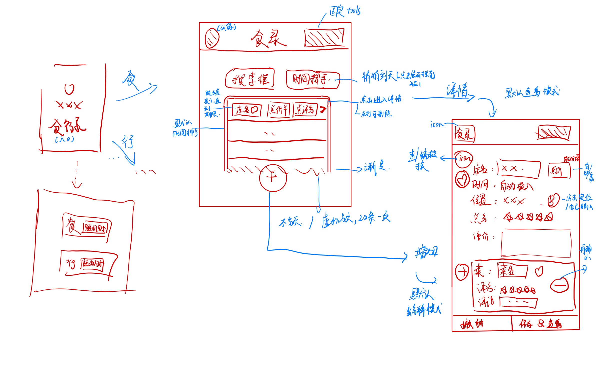

# 食录 
## 版本预计
- v1 微信小程序
- v1b app
- v2 同步到网页版blog
- a1 行录，功能合并
## 用法 
1. 新增，删除，编辑 item
2. 可根据时间 文本匹配搜索历史记录，时间为范围
3. 总体展示店名，是否为like，位置
4. 同步交互，是否同步完成指示
5. item细节 
    1. 时间默认为新增时间，可修改
    2. 店名 总价 总评分 文本评价 单店面可添加为like
    3. 位置，gps定位 or 文字描述（地铁优先，，跳转美团？）
    4. 添加 各项菜名 菜评分 菜文本评价 单菜品可添加为like 
## 技术细节
1. 一条item时间通过一个id+json string+时间存储，这样好做搜索匹配
2. ui库，好看流畅
3. 本地储存优先，研究是否可同步到备忘录等，onedrive api其次，自建数据库第三
4. 是否支持图片上传存储？

## 想法
1. 如果支持图片也可以做成小红书那种样子的，九宫格图片hhh

## UI 库不错
1. tddesign  选用！
  - 搜索框，⌚️搜索框
  - 评分（带半星）
2. iview UI 
  - 滑动菜单不错
3. color ui
  - 滑动菜单
  - 一些动画效果
4. vant ui
  - 评分
  - 整体看上去不错
  - 需要vue开发
5. taro
  - 日历范围选择不错
  - 有人吐槽不好用
## 设计
### v1
  